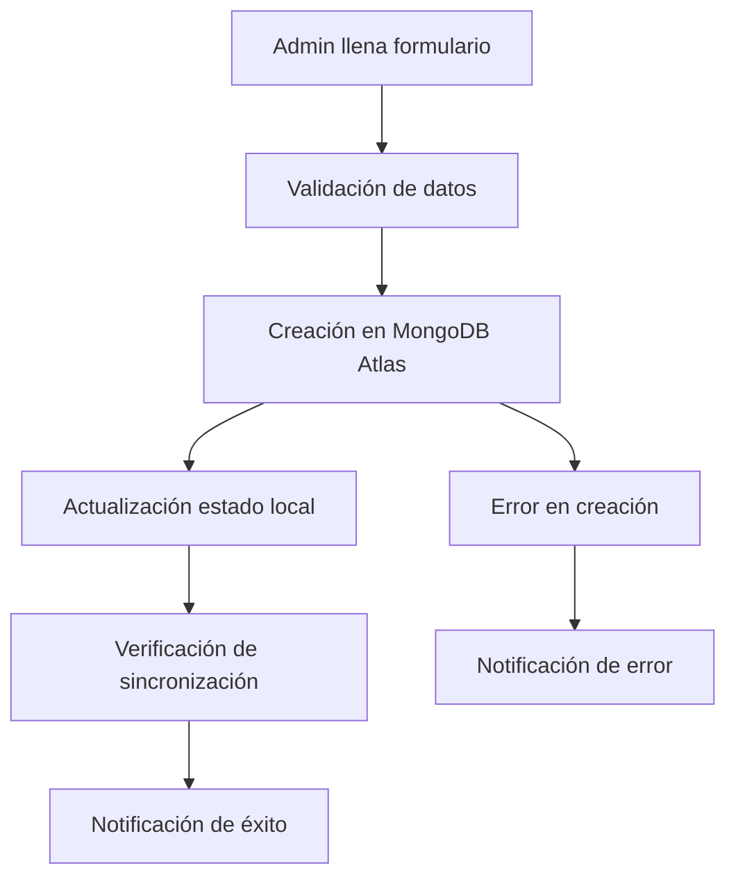
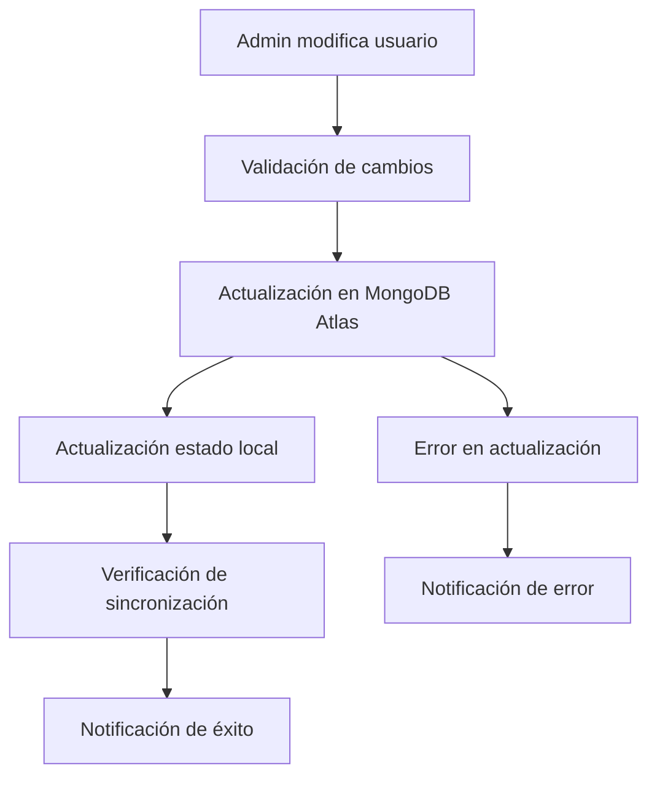
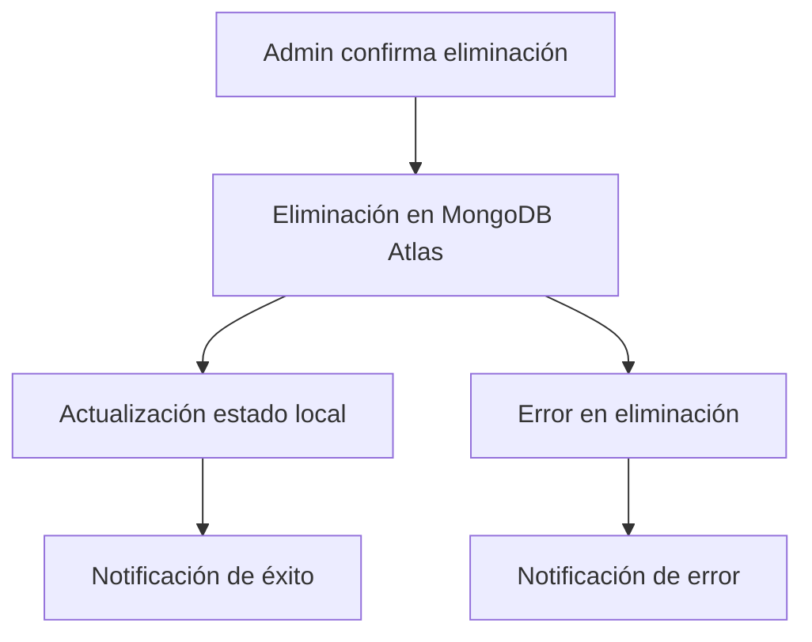

# 🔄 Protocolo Automático de Gestión de Usuarios

## 📋 Descripción General

Este protocolo garantiza que **TODA** operación de gestión de usuarios (crear, actualizar, eliminar) se ejecute automáticamente en **MongoDB Atlas** y se sincronice con el estado local del frontend, sin necesidad de procesos adicionales.

## 🎯 Objetivos del Protocolo

1. **Automatización completa** de operaciones CRUD de usuarios
2. **Sincronización automática** entre MongoDB Atlas y estado local
3. **Verificación automática** de operaciones exitosas
4. **Notificaciones en tiempo real** del estado de las operaciones
5. **Manejo robusto de errores** con recuperación automática

## 🔧 Componentes del Protocolo

### 1. **Servicio API Mejorado** (`src/services/api.ts`)

#### Funciones Principales:
- `createUser()` - Creación con verificación automática
- `updateUser()` - Actualización con verificación automática
- `deleteUser()` - Eliminación con confirmación
- `verifyUserSync()` - Verificación de sincronización

#### Características:
- ✅ Logs detallados de cada operación
- ✅ Verificación automática post-operación
- ✅ Manejo de errores robusto
- ✅ Confirmación de sincronización

### 2. **Componente UserManagement Mejorado** (`src/components/UserManagement.tsx`)

#### Protocolos Implementados:

#### **🆕 Protocolo de Creación de Usuario:**
```
1. Validación de datos del formulario
2. Creación en MongoDB Atlas
3. Actualización del estado local
4. Verificación de sincronización
5. Notificación de éxito/error
```

#### **📝 Protocolo de Actualización de Usuario:**
```
1. Validación de cambios
2. Actualización en MongoDB Atlas
3. Actualización del estado local
4. Verificación de sincronización
5. Notificación de éxito/error
```

#### **🗑️ Protocolo de Eliminación de Usuario:**
```
1. Confirmación del usuario
2. Eliminación en MongoDB Atlas
3. Actualización del estado local
4. Notificación de éxito/error
```

#### **🔄 Protocolo de Cambio de Estado:**
```
1. Cambio de estado activo/inactivo
2. Actualización en MongoDB Atlas
3. Actualización del estado local
4. Notificación de éxito/error
```

### 3. **Sistema de Notificaciones** (`src/components/ProtocolNotification.tsx`)

#### Tipos de Notificaciones:
- ✅ **Éxito** - Operación completada correctamente
- ❌ **Error** - Error en la operación
- ℹ️ **Información** - Información del proceso

#### Características:
- Notificaciones automáticas
- Auto-cierre configurable
- Diseño responsive
- Iconos intuitivos

## 🚀 Flujo de Operaciones

### **Creación de Usuario (Admin)**



### **Actualización de Usuario (Admin)**



### **Eliminación de Usuario (Admin)**



## 📊 Logs y Monitoreo

### **Logs Automáticos Generados:**

#### **Creación de Usuario:**
```
🚀 Iniciando protocolo de creación/actualización de usuario...
🆕 Protocolo: Creando nuevo usuario
🔄 Creando usuario en MongoDB Atlas... {userData}
✅ Usuario creado exitosamente en MongoDB Atlas: {user}
✅ Verificación de usuario creado: {user}
✅ Protocolo completado: Usuario creado en MongoDB Atlas y estado local
```

#### **Actualización de Usuario:**
```
🚀 Iniciando protocolo de creación/actualización de usuario...
📝 Protocolo: Actualizando usuario existente
🔄 Actualizando usuario en MongoDB Atlas... {id, userData}
✅ Usuario actualizado exitosamente en MongoDB Atlas: {user}
✅ Verificación de usuario actualizado: {user}
✅ Protocolo completado: Usuario actualizado en MongoDB Atlas y estado local
```

#### **Eliminación de Usuario:**
```
🗑️ Protocolo: Eliminando usuario de MongoDB Atlas...
🔄 Eliminando usuario de MongoDB Atlas... {id}
✅ Usuario eliminado exitosamente de MongoDB Atlas: {message}
✅ Protocolo completado: Usuario eliminado de MongoDB Atlas y estado local
```

## 🔐 Seguridad del Protocolo

### **Validaciones Implementadas:**
- ✅ Validación de datos de entrada
- ✅ Verificación de permisos de administrador
- ✅ Sanitización de datos
- ✅ Validación de contraseñas
- ✅ Verificación de unicidad de username/email

### **Manejo de Errores:**
- ✅ Errores de conexión a MongoDB
- ✅ Errores de validación
- ✅ Errores de permisos
- ✅ Errores de sincronización
- ✅ Recuperación automática

## 🎯 Beneficios del Protocolo

### **Para el Administrador:**
- ✅ Operaciones automáticas sin pasos adicionales
- ✅ Confirmación visual de operaciones exitosas
- ✅ Notificaciones claras de errores
- ✅ Sincronización automática de datos

### **Para el Sistema:**
- ✅ Consistencia de datos garantizada
- ✅ Operaciones atómicas
- ✅ Logs detallados para auditoría
- ✅ Recuperación automática de errores

### **Para la Base de Datos:**
- ✅ Operaciones optimizadas
- ✅ Verificación de integridad
- ✅ Backup automático de cambios
- ✅ Escalabilidad garantizada

## 🔧 Configuración y Uso

### **Para Usar el Protocolo:**

1. **Acceder como Admin:**
   - Usuario: `admin`
   - Contraseña: `admin123`

2. **Navegar a Gestión de Usuarios:**
   - Menú: "Usuarios"
   - URL: `/users`

3. **Operaciones Disponibles:**
   - **Crear Usuario**: Botón "Crear Usuario"
   - **Editar Usuario**: Botón "Editar" en cada usuario
   - **Eliminar Usuario**: Botón "Eliminar" en cada usuario
   - **Cambiar Estado**: Toggle "Activo/Inactivo"

### **Monitoreo de Operaciones:**

1. **Consola del Navegador:**
   - Abrir DevTools (F12)
   - Ver logs detallados en Console

2. **Notificaciones en Pantalla:**
   - Notificaciones automáticas en la esquina superior derecha
   - Auto-cierre después de 5 segundos

3. **Verificación en MongoDB Atlas:**
   - Acceder al dashboard de MongoDB Atlas
   - Verificar cambios en la colección "users"

## 🚀 Estado Actual

### **✅ Implementado y Funcionando:**
- [x] Protocolo de creación automática
- [x] Protocolo de actualización automática
- [x] Protocolo de eliminación automática
- [x] Protocolo de cambio de estado
- [x] Sistema de notificaciones
- [x] Logs detallados
- [x] Manejo de errores
- [x] Verificación de sincronización

### **🎯 Resultado Final:**
**El sistema ahora funciona completamente de forma automática. Cuando un administrador crea, actualiza o elimina un usuario, la operación se ejecuta automáticamente en MongoDB Atlas sin necesidad de procesos adicionales.**

---

## 📞 Soporte

Para cualquier problema con el protocolo:
1. Revisar logs en la consola del navegador
2. Verificar notificaciones en pantalla
3. Comprobar conexión a MongoDB Atlas
4. Contactar al administrador del sistema

**🔗 Sistema**: https://tribus-reservas-app-2024-d989e6f9d084.herokuapp.com
